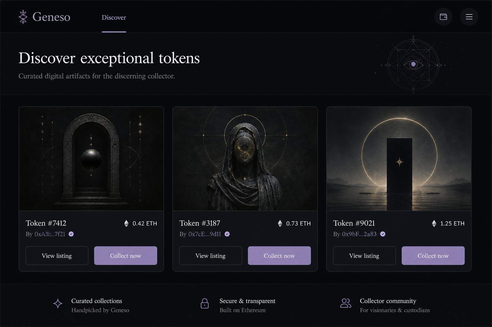
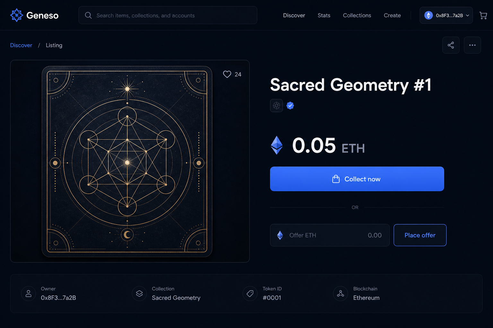

# Руководство для покупателей — Geneso NFT

**Адреса маркетплейса:** см. [ADDRESSES.md](./ADDRESSES.md).

Иллюстрации — **схематичные макеты**; реальный сайт может слегка отличаться по вёрстке.

---

## 1. Что понадобится

1. **Кошелёк** (например **MetaMask**) с сетью **Ethereum mainnet**.
2. **ETH** на кошельке:
   - для **покупки** — сумма не меньше цены листинга плюс gas;
   - для **предложения (оффера)** — сумма предложения плюс gas.
3. Понимание, что сделки с NFT **необратимы** после подтверждения в блокчейне (кроме отдельных сценариев в контракте — например отзыв оффера покупателем до принятия).

---

## 2. Подключение и язык

1. Откройте маркетплейс (см. [ADDRESSES.md](./ADDRESSES.md)).
2. Переключатель **EN / RU** в шапке задаёт язык интерфейса (настройка сохраняется в браузере).
3. **Подключите кошелёк** — кнопка в правом верхнем углу, подтвердите в расширении.

---

## 3. Просмотр витрины

На главной странице **Discover** / **Витрина** отображаются активные листинги: обложка (если есть метаданные), название, цена в ETH, продавец.

*Рис. 1. Сетка листингов (схема).*

- **«Открыть листинг»** / **View listing** — переход на страницу одного лотa.
- **«Купить сейчас»** / **Collect now** — покупка по указанной цене (см. раздел 4).
- Поле **предложения в ETH** и кнопка **«Сделать предложение»** — размещение оффера (см. раздел 5).

Вы не можете купить у самого себя: если листинг ваш, кнопка покупки будет неактивна.

---

## 4. Покупка (фиксированная цена)

1. Откройте карточку или страницу листинга.
2. Нажмите **«Купить сейчас»** / **Collect now**.
3. В кошельке проверьте:
   - сумму перевода (цена лотa);
   - комиссию сети (gas);
   - адрес контракта маркетплейса (должен совпадать с ожидаемым для Geneso).
4. Подтвердите транзакцию. После майнинга NFT переходит на ваш адрес согласно смарт-контракту.

*Рис. 2. Страница листинга и покупка (схема).*

**Важно:** ошибки сети, фишинг и неверный контракт могут привести к потере средств. Пользуйтесь только официальными ссылками из [ADDRESSES.md](./ADDRESSES.md).

---

## 5. Предложение (оффер)

1. На витрине или странице лота введите сумму в ETH в поле оффера.
2. Нажмите **«Сделать предложение»** / **Place offer**.
3. Подтвердите транзакцию в кошельке (в контракте обычно задаётся срок действия предложения).

Продавец может **принять** оффер; до принятия вы можете **отозвать** предложение там, где интерфейс это позволяет (раздел **«Предложения»** / **Offers**, **«Профиль»**).

---

## 6. Раздел «Предложения»

Страница **Offers** / **Предложения** показывает активные ставки по листингам: сумма, покупатель, продавец, статус. Продавец может принять; покупатель — отозвать свою ставку, если это предусмотрено контрактом и UI.

---

## 7. Профиль

В **Profile** / **Профиль** после подключения кошелька доступно:

- статус подключения и адрес;
- статистика (листинги, офферы, покупки — по данным контракта);
- ваши листинги и офферы;
- лента активности.

Адрес можно **скопировать** кнопкой в блоке кошелька (если функция включена в вашей версии сайта).

---

## 8. Частые вопросы

| Вопрос | Ответ |
|--------|--------|
| Почему не грузится картинка NFT? | Метаданные по `tokenURI` недоступны или ссылка битая — это не всегда вина маркетплейса |
| Транзакция долго висит | Загрузка Ethereum; можно ускорить в кошельке за счёт большей цены gas |
| Отменить покупку после подтверждения | Нет, сеть Ethereum не откатывает успешную покупку произвольно |
| Где посмотреть токен в кошельке | После покупки NFT должен отображаться в разделе NFT MetaMask или в обозревателе по вашему адресу |

---

## 9. Правовая информация

Разделы **Конфиденциальность**, **Условия**, **Cookie** в подвале сайта. Маркетплейс не хранит ваши seed-фразы; ответственность за кошелёк — на вас.

---

*Документ отражает интерфейс Geneso nft-web на момент подготовки. При обновлениях продукт возможны мелкие отличия в названиях кнопок.*
