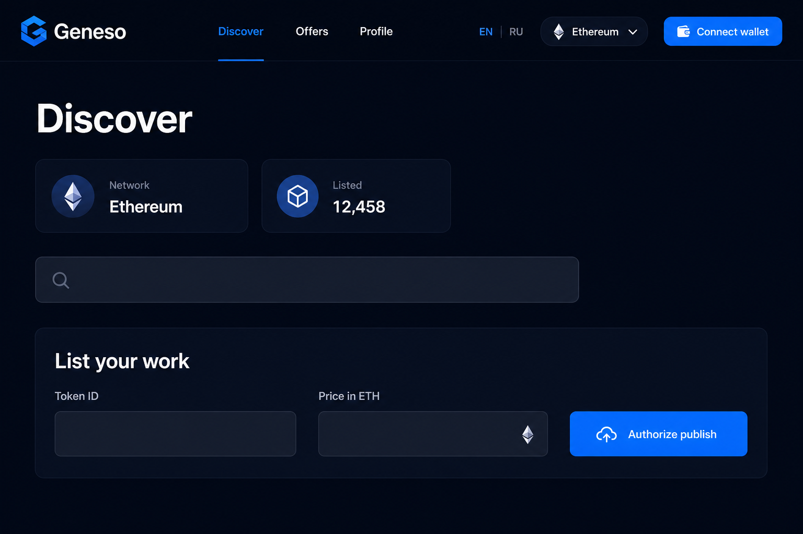
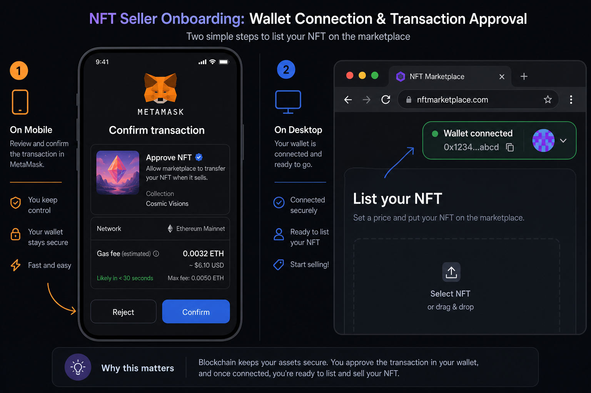

# Руководство для продавцов — Geneso NFT

**Адреса маркетплейса:** см. [ADDRESSES.md](./ADDRESSES.md).

Иллюстрации ниже — **схематичные макеты** интерфейса; подписи кнопок и полей на реальном сайте совпадают с английской/русской локализацией Geneso.

---

## 1. Что понадобится

1. **Кошелёк** с поддержкой Ethereum (обычно браузерное расширение **MetaMask** или совместимый кошелёк).
2. **Сеть Ethereum mainnet** — в кошельке выберите именно основную сеть Ethereum, не тестовую.
3. **ETH на газ** — на кошельке должно быть достаточно эфира для комиссий сети (gas). Размер комиссии зависит от загрузки сети и сложности транзакций (approve + create listing — две операции).
4. **NFT в коллекции Geneso** (или другой поддерживаемой ERC-721), токен которого **принадлежит вашему кошельку**. Без владения токеном вы не сможете выставить его на продажу.

---

## 2. Подключение кошелька

1. Откройте маркетплейс (см. [ADDRESSES.md](./ADDRESSES.md)).
2. В правом верхнем углу нажмите **«Подключите кошелёк»** / **Connect your wallet** (или аналог после переключения языка **RU / EN**).
3. Подтвердите подключение в окне кошелька.
4. Убедитесь, что в шапке отображается **Ethereum** (или ожидаемое имя сети) и сокращённый адрес вашего кошелька.

Если кошелёк «завис» на запросе — откройте расширение MetaMask, примите или отклоните запрос; при необходимости отключите сайт в **Connected sites** и подключите снова.

*Рис. 1. Витрина и блок «Выставьте работу» (схема интерфейса).*

---

## 3. Выставление NFT на продажу (листинг)

Действия выполняются на странице **«Витрина»** / **Discover** (главная).

### Шаг 3.1. Заполните форму

1. Найдите блок **«Выставьте работу»** / **List your work**.
2. **ID токена** — введите числовой `tokenId` вашего NFT (тот, что у контракта коллекции).
3. **Цена в ETH** — введите цену продажи в эфире (десятичная точка, например `0.05`).

### Шаг 3.2. Подтвердите в кошельке (две транзакции)

1. Нажмите **«Разрешить и опубликовать»** / **Authorize & publish** (или сначала публикация — в зависимости от версии UI; по смыслу выполняются **approve** маркетплейсу на ваш токен и **createListing**).
2. В MetaMask подтвердите транзакцию **разрешения** (approve): маркетплейс получает право передавать указанный токен при продаже.
3. После подтверждения в сети подтвердите вторую транзакцию — **создание листинга** с ценой.

Пока транзакции в mempool, кнопки могут быть неактивны; дождитесь появления записи в обозревателе блоков (Etherscan).

*Рис. 2. Подтверждение в кошельке (схема).*

### Шаг 3.3. Проверка

- На витрине в списке листингов должна появиться **ваша** карточка (продавец — ваш адрес).
- В **«Профиль»** / **Profile** в блоке **«Ваши листинги»** отображается активный листинг.

---

## 4. Управление листингом

### Снять с продажи

- На карточке листинга (витрина) или на странице товара, если вы продавец, доступна кнопка **«Снять с продажи»** / **Withdraw listing**. Подтвердите транзакцию в кошельке.

### Предложения (офферы)

- Покупатели могут сделать **предложение** в ETH. В разделе **«Предложения»** / **Offers** и в **«Профиль»** вы увидите входящие ставки.
- Как продавец вы можете **принять предложение** (**Accept offer**) — подтвердите в кошельке; условия смарт-контракта выполняются на блокчейне.

---

## 5. Частые проблемы

| Проблема | Что проверить |
|----------|----------------|
| «Недостаточно ETH» | Пополните баланс для gas и, при покупке другим лицом, логика оплаты у покупателя |
| Неверная сеть | Только **Ethereum mainnet** |
| Транзакция откатилась | Токен уже не у вас, нет approve, неверная цена, листинг закрыт — смотрите текст ошибки в кошельке и на сайте |
| Не видно NFT | Проверьте `tokenId` и контракт коллекции, что токен на вашем адресе |
| Сайт без адресов контрактов | Для администраторов: переменные окружения `VITE_*` и пересборка фронта |

---

## 6. Где картинки и метаданные NFT

Обложка и название на карточке подтягиваются из **tokenURI** контракта (часто IPFS или data URI). Если картинка не грузится, проверьте доступность URI и шлюз.

---

## 7. Правовая информация

На сайте доступны страницы **Конфиденциальность**, **Условия**, **Cookie**. Тексты носят информационный характер; юридические вопросы по продаже контента решайте с правообладателем и юристом.

---

*Документ отражает логику интерфейса Geneso nft-web на момент подготовки руководства. При обновлении продукта отдельные подписи кнопок могут измениться.*
